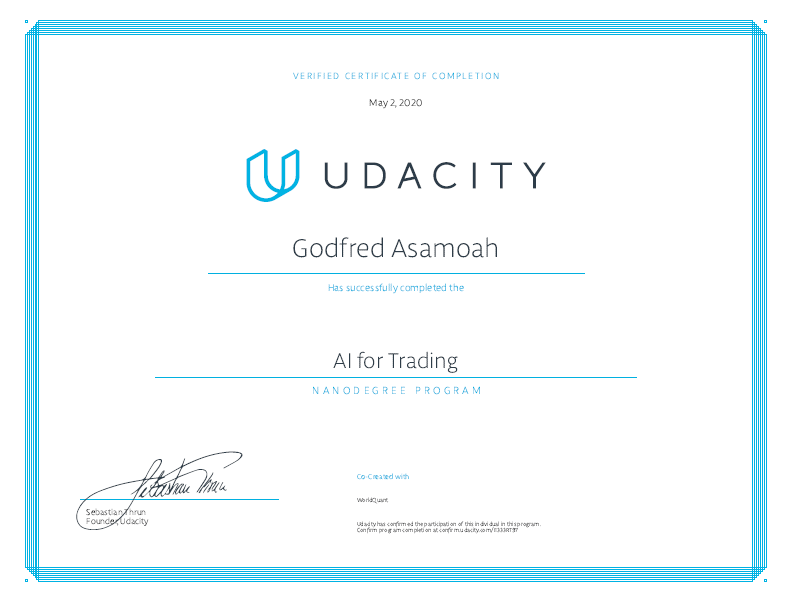

# AI For Trading Nanodegree Projects

This repository contains my projects for Udacity's [AI For Trading Nanodegree Program](https://www.udacity.com/course/ai-for-trading--nd880).

## Projects

- [1 - Trading with Momentum](/1-trading-momentum): Implement a momentum trading strategy and test if it has the potential to be profitable. You will work with historical data of a given stock universe and generate a trading signal based on a momentum indicator, compute the signal and produce projected returns and perform a statistical test to conclude if there is alpha in the signal.

- [2 - Breakout Strategy](/2-breakout-strategy): Implement the breakout strategy, find and remove outliers, and test to see if it can be a profitable strategy.

- [3 - Smart Beta and Portfolio Optimization](/3-smart-beta): Build a smart beta portfolio against an index and optimize a portfolio against quadratic programming.

- [4 - Alpha Research and Factor Modeling](/4-alpha-research): Research and implement alpha factors, and build a risk factor model. Use alpha factors and risk factors to optimize a portfolio.

- [5 - NLP on Financial Statements](/5-nlp-financial-statements): NLP Analysis on 10-k financial statements to generate an alpha factor.

- [6 - Sentiment Analysis with Neural Networks](/6-sentiment-analysis): Build a deep learning model to classify the sentiment of news data. Run backtests and apply the models to news data for signal generation.

- [7 - Combining Signals for Enhanced Alpha](/7-combining-signals): Build a random forest to generate better alpha. Create a model for the S&P 500 and its constituent stocks by selecting a model for a large data set which includes market data, fundamental data and alternative data. Rank and select stocks to construct a long/short portfolio based on the prediction results.

- [8 - Backtesting](/8-backtesting): Construct an OHLC data feed and a backtesting framework. Construct trading strategies using various parameters such as trade days, take profit levels, stop loss levels, etc, then optimize the parameters and evaluate the performance by analyzing the results of the backtests.

## Graduation Certificate🎉🎉

[Certificate Link](https://confirm.udacity.com/E333RT97)
